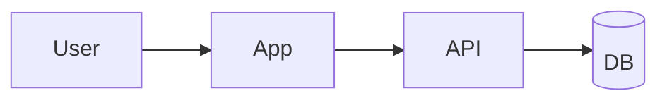

# {Product}: MVP PRD

_Summary: {who} struggles with {problem}; {product} lets them {outcome}. MVP succeeds if {metric}._

## Users and problem
- **Primary user:** {who, context}
- **Problem:** {pain, current workaround}
- **Why now / why us:** {one line; link to [market research](docs/research/market.md) if it exists}

## Constraints
| Team | Timeline | Budget/hosting | Compliance |
|---|---|---|---|

## Scope
| # | Feature | Acceptance criteria |
|---|---|---|
| F1 | | - {observable criterion} |

**Non-goals (MVP):** {explicitly out}. The deferred list lives in [TODO.md](TODO.md).

## Stack and architecture
| Layer | Choice | ADR |
|---|---|---|
| Frontend | | [0001](docs/decisions/0001-….md) |
| Backend / API | | |
| Data | | |
| Auth | | |
| Hosting / CI | | |

**Core data model:** {Entity}: {key fields} → {relation}. Terms are defined in [GLOSSARY.md](GLOSSARY.md).
**Key contracts:** {endpoint/interface}: {input} → {output}

## Quality baseline
- **Testing:** {levels, tools, must-cover flows}
- **Security:** {auth model, secrets, top risks and mitigations, dependency scanning}
- **Deploy:** {workflow mode (Solo/Team), envs, pipeline, rollback}
- **NFRs:** {p95 latency, expected scale, observability}

## Project specifics
{Pricing / key feature deep-dives / onboarding: only the areas grilled in step 7. Split large ones into docs/features/<name>.md}

## Success metrics
- {metric}: {target} by {when}

## Risks and open questions
| Risk / question | Impact | Mitigation / owner |
|---|---|---|
